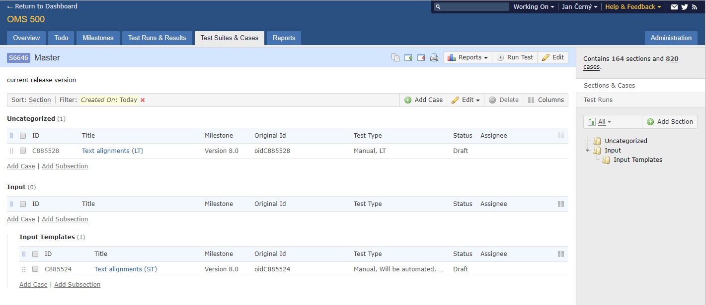
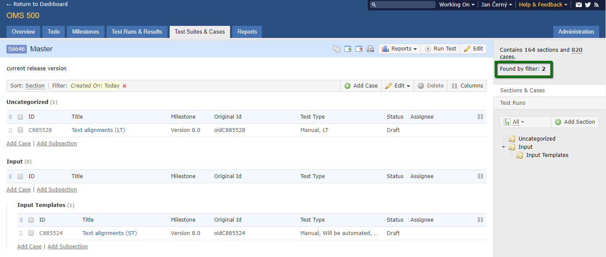

# TestRail TestCasesCount
This add-on injects JavaScript into TestRail web pages for getting count of Test Cases found by filter. 

Compatible with TestRail *5.6.1.3841* and lower.

Before add-on: 

After add-on:

## Release Notes
### v1.1
* fixed bug: Sometimes result is +1

### v1.0
* bumped version

## Add-on for FireFox
[TestRail TestCasesCount v1.1](https://addons.mozilla.org/en-US/firefox/addon/testrail-testcasescount/)

## Add-on for Chrome
* download file [TestRail TestCasesCount v1.1](https://github.com/cernyjan/TestRail-TestCasesCount/releases/tag/v1.1)
* extract it on the file system
* open Extensions page in browser
* click the “Developer mode” checkbox to activate it
* click the “Load unpacked extension” button
* Navigate to the extension’s directory and open it